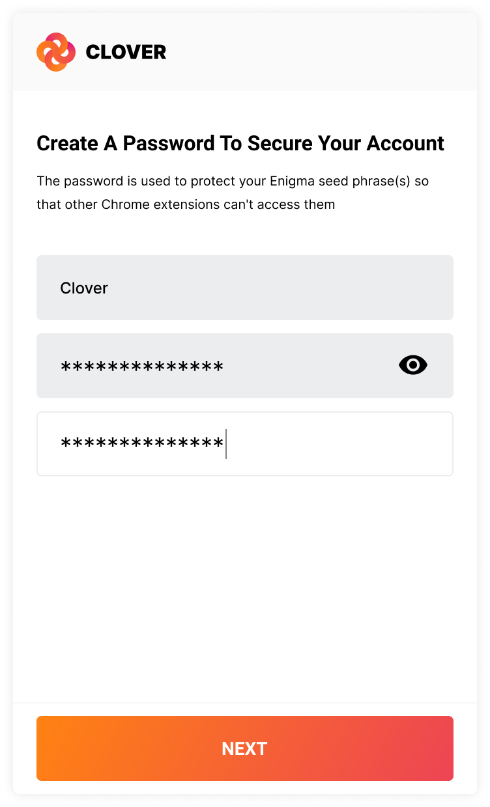
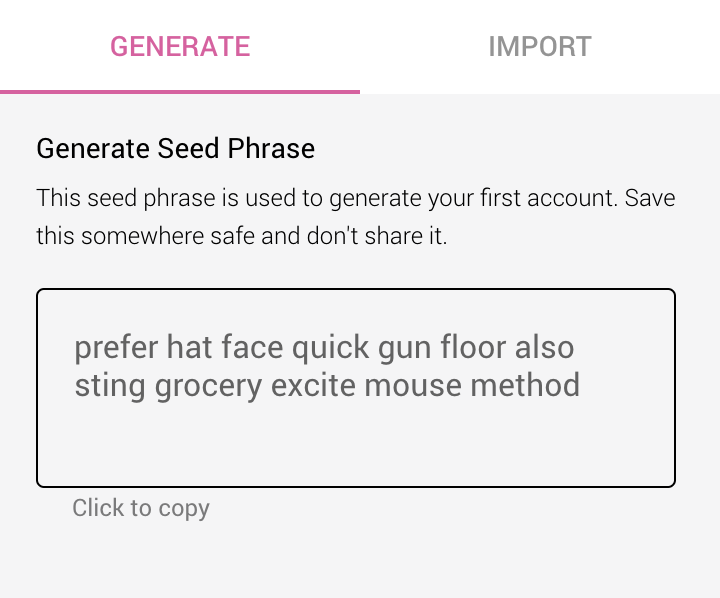
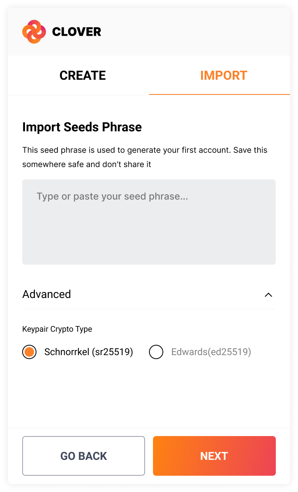
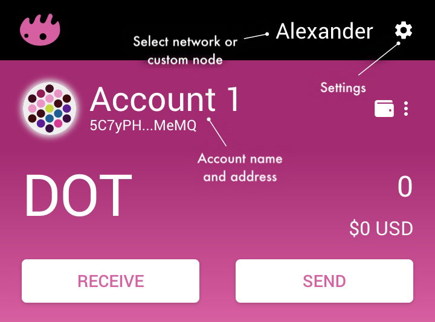
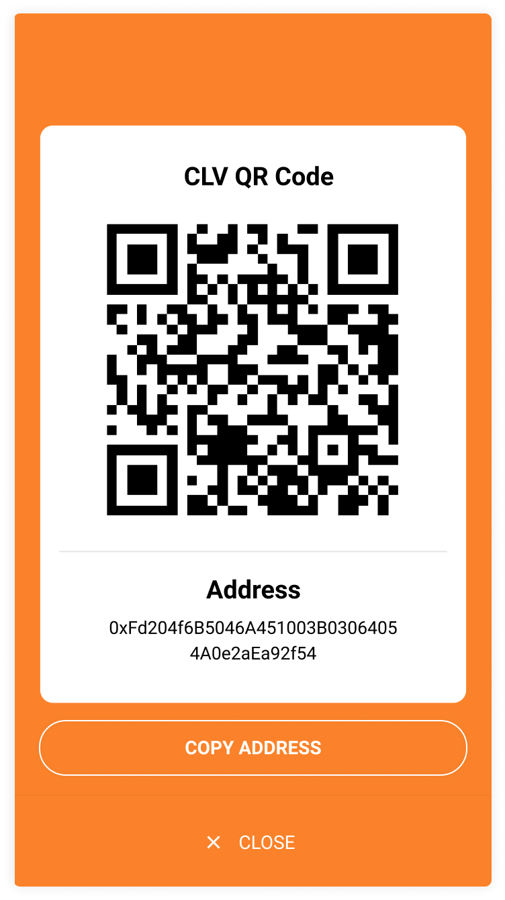
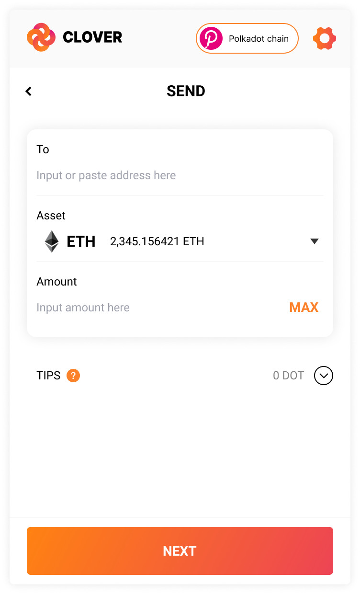
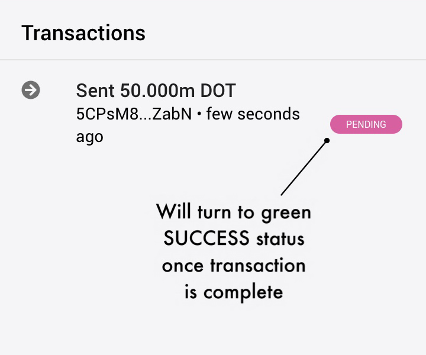
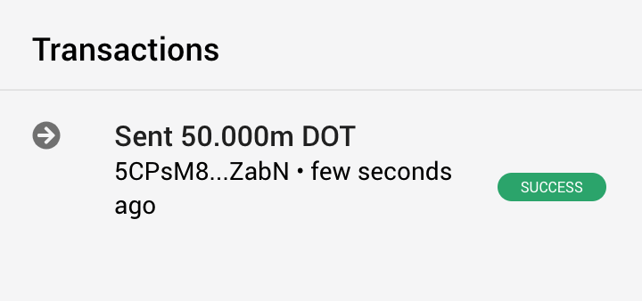

# Enzyme

Enzyme is a wallet for for [Polkadot blockchain.](https://polkadot.network/)

Enzyme is currently a work in progress, so changes will occur.

## Prerequisites

- NodeJS >= v11
- Yarn latest

## Get It

Once published Enzyme will be installable from the Chrome Web Store. Until then, it can be run via yarn by cloning this repo. Unpacked builds will be made available at [https://github.com/blockxlabs/enzyme](https://github.com/blockxlabs/enzyme) shortly.

### Installation

Execute the following to clone, install dependencies, and run a development server:

    git clone https://github.com/blockxlabs/enzyme.git
    cd enzyme
    yarn install
    yarn run dev

Once running Chrome:

- Go to chrome://extensions
- Enable 'Developer Mode' (top right corner of window)
- Click "Load Unpacked" and select the enzyme/dev/chrome directory
- Navigate to : https://localhost:3000 and accept the https connection

The Enzyme icon should show up in your Chrome toolbar.

Once running Firefox:

- Go to about:debugging#/runtime/this-firefox
- Click 'Load Temporary Addon' 
- select the enzyme/dev/firefox directory
- Navigate to : https://localhost:3000 and accept the https connection

The Enzyme icon should show up in your Firefox toolbar.

## Getting Started

### Initial Setup

After agreeing to the Terms of Use, create a strong password. This is used to encrypt your data so that other Chrome extensions can't read it.

If you want to start fresh, use the newly-generated account. Copy the seed phrase and save it somewhere safe (as it is required to send DOTs and sign transactions).

If you have an existing account you want to use, click the Import tab and paste your existing seed phrase in.

## Usage

### Dashboard
See labels on screenshot.

### Receive
Just click Receive from the main screen to get here.

Either scan the QR code, or copy and paste the account address by clicking it.

### Send

Input the details

Verify the details

Once sent, wait for it to confirm.

It has confirmed.

## Links

License: [AGPL v3](https://github.com/blockxlabs/enzyme/blob/master/LICENSE.md)
